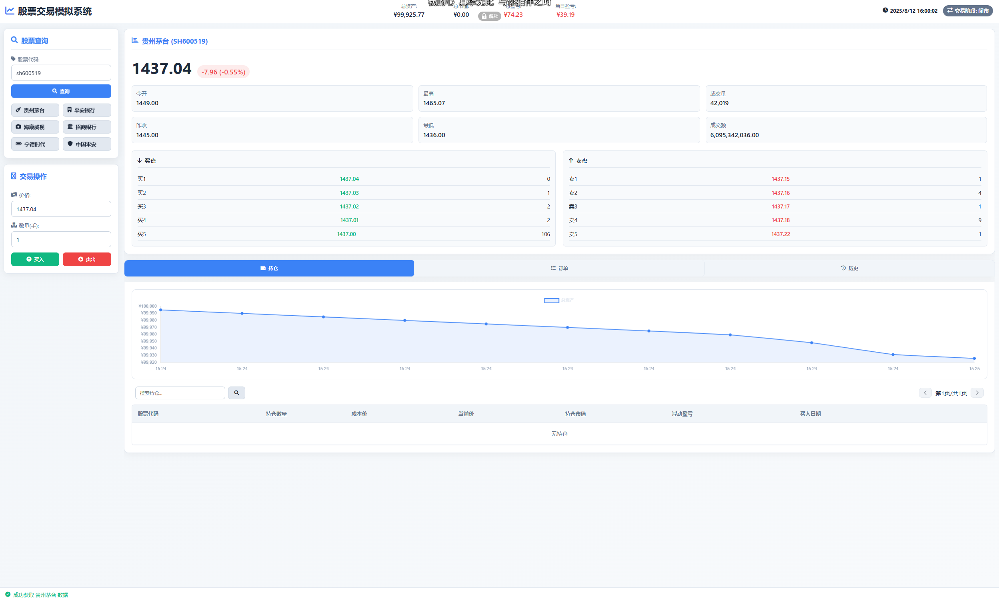

# Stock Demo Trading Server

<div align="center">

**A 股模拟交易系统**

[](https://python.org)
[](LICENSE)
[](https://flask.palletsprojects.com/)

[**English**](README.md)

</div>

## 简介

一个完整的 A 股模拟交易平台，包含后端交易引擎、实时数据爬虫和前端交易界面。模拟真实交易环境，支持 T+1 规则、涨跌停限制、交易费用计算等。



## 特性

- **真实交易规则**：T+1、集合竞价、涨跌停、佣金/印花税/过户费
- **实时数据**：从东方财富获取实时股票行情
- **交易时段管理**：自动识别盘前/盘中/盘后/休市状态
- **持仓管理**：支持多次买入、分批卖出、成本价计算
- **挂单撮合**：限价单自动撮合，支持撤单
- **数据持久化**：自动保存交易状态，重启不丢失
- **桌面控制面板**：tkinter 控制窗口，一键启动

## 快速开始

### 1. 安装依赖

```bash
pip install -r requirements.txt
```

### 2. 启动

```bash
python app.pyw
```

系统会弹出控制面板窗口，点击"打开浏览器"即可访问 `http://127.0.0.1:5000` 交易界面。

## 项目结构

```
Stock-demo-trading-server/
├── app.pyw             # Flask 应用入口 + tkinter 控制面板
├── trading_api.py      # 交易引擎核心（下单/撮合/持仓/T+1）
├── crawler.py          # 东方财富实时行情爬虫
├── common.py           # 交易时段规则、费用计算、节假日判断
├── requirements.txt    # Python 依赖
├── static/
│   ├── css/style.css   # 前端样式
│   └── js/app.js       # 前端逻辑
├── templates/
│   └── index.html      # 交易界面
├── data/               # 运行时数据（自动生成）
└── image/              # 截图
```

## API 接口

| 方法 | 路径 | 说明 |
|------|------|------|
| GET | `/api/portfolio` | 获取投资组合（资金/持仓/收益） |
| GET | `/api/stock/<code>` | 获取股票实时行情 |
| POST | `/api/buy` | 买入股票 |
| POST | `/api/sell` | 卖出股票 |
| POST | `/api/cancel_order` | 撤单 |
| GET | `/api/orders` | 获取所有订单 |
| GET | `/api/history` | 获取交易历史 |
| GET | `/api/trading_phase` | 获取当前交易阶段 |
| GET | `/api/equity_history` | 获取资金曲线 |

## 交易规则

| 规则 | 说明 |
|------|------|
| T+1 | 当日买入，下一交易日可卖出 |
| 交易时间 | 9:30-11:30 / 13:00-15:00 |
| 集合竞价 | 9:15-9:25 |
| 买入佣金 | 万 2.5（最低 5 元）+ 过户费万 0.1 |
| 卖出佣金 | 万 2.5 + 印花税千 1 + 过户费万 0.1 |

## 许可证

MIT License
